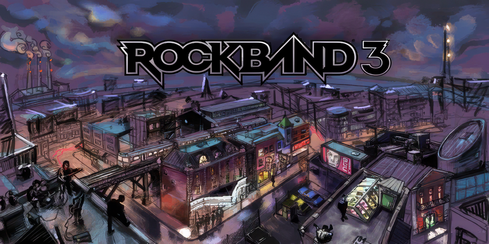

# Rock Band 3 Lost Songs

Welcome to the Rock Band Lost Songs repo. This repo contains lost Rock Band Network songs, lost Rock Band 1-2 DLC, and ports of charts that were included in the early 2010 development builds of Rock Band 3, but were cut from the final release of the game.

## Beta songs ported over:
* Blood, Sweat & Tears - Spinning Wheel
* Chris n' Jeff - Beatmatch Test w/ Music!
* Chris the Bill and the Gang - Strum Test, with Real Bass
* Jefferson Airplane - Somebody to Love
* Night Ranger - Sister Christian '09
* Ozzy Osbourne - Crazy Train (2002 version)
* Santana - Black Magic Woman/Gypsy Queen
* Traffic - Feelin' Alright

## Lost Rock Band 1-2 DLC (Thank you to Fleecy and r0bd0g for helping out with fixing up these songs):
* Faith No More - We Care a Lot (Cover)
* Indochine - L'Aventurier
* Metallica - Fuel
* Metallica - King Nothing
* Nirvana - Come As You Are (Cover)
* The Rolling Stones - Brown Sugar (Cover)
* The Who - Behind Blue Eyes (Cover)
* The Who - Pinball Wizard (RB1 version)

## Lost Rock Band Network 1.0:
* Coalmine - Canary
* The Romantics - Talking In Your Sleep (v1/2)
* Wheatus - Teenage Dirtbag 2010

## Lost Rock Band Network 2.0 (Thank you to AddyMills, BongOfDestiny, MiloHax, and RhythmVerse for getting these songs preserved):
* 2011-02-28 HMXLachesis Upload #4 - 2011-02-28 HMXLachesis Upload #4 (Don't Let Me Down (Slowly) (RB3 version))
* All Shall Perish - Divine Illusion
* All Shall Perish - Royalty Into Exile
* Amberian Dawn - Letter
* Anarchy Club - Behind the Mask
* Anarchy Club - Hidden Secret Song
* Ascension - Orb of the Moons (2x option available)
* Ascension - Somewhere Back in Time (2x option available)
* Askari Nari - Looks Good
* Blood on the Dance Floor - Hollywood Tragedy
* Blood on the Dance Floor - Incomplete and All Alone (feat. Joel Madden) (2x option available)
* Blood on the Dance Floor - Unforgiven
* Bumblefoot - Delilah
* Bumblefoot - Guitars SUCK! (RB3 version)
* Carbeast - Airlock
* Celldweller - Unshakeable
* Chaotrope - Yuukei
* Children of Nova - Erratic
* Chris Lee - Boss
* Christian Muenzner - Rocket Shop
* Death of the Cool - Cuts Like a Knife
* Decibelle - Life
* Dying Fetus - Ethos of Coercion
* Engineering an Empire - Artisan
* Eurobeat Brony - Luna (NIGHTMARE MODE) (ft. Odyssey)
* Fail Emotions - Dance Macabre (2x option available)
* Fail Emotions - Makes Bad (2x option available)
* Fail Emotions - Shades (2x option available)
* Fail Emotions - Suit & Tie
* Fist of the North Star - Roaches
* Gatling - Ten Forward
* Jim Morris Band - River of Blood
* KMFDM - Godlike
* Lechuga - O Vurdn
* Left Spine Down - X-Ray
* Matthew Rybicki - Nouakchott
* Melanie - Brand New Key
* Mike Orlando - Dig It
* Mors Principium Est - Bringer of Light
* Mors Principium Est - Departure
* Myrath - Merciless Times
* Nathaniel Whitlock - Snow Zombies (NSFR mix)
* Nekrogoblikon - A Fest
* Nightrage - Clocked in Wolf Skin
* Nya - The Choir Invisible
* Nya - You Are
* Origin - Expulsion of Fury
* Philip Franco - Jam (RB3 version)
* Philip Franco and the Jam Band - Jam 2
* POM - Deep Shift
* Re-neg0a0-s8r48s7p - Break
* Re-neg0a0-s8r48s7p - Never Win
* Re-neg0a0-s8r48s7p - Skies of Sky Blue
* Revocation - Beloved Horrifier
* Revocation - Conjuring the Cataclysm
* Revocation - No Funeral
* Revocation - The Watchers
* Richard Campbell - Shadow of the Beast
* Rishloo - Freaks and Animals
* Silent House - Miracle
* Silent House - The Infinite Sadness
* The Spittin' Cobras - All the Way
* Superfluous Motor - Schizophrenic Seizure (ft. Paolo Viteri)
* Synthetic Breed - Resilience
* Teramaze - Ahnedonia
* Teramaze - Machine
* Vallejo - Gone
* Various Artists - Rock Band Network Megamix 02 (Recreation by Bakartridge)
* The Worshyp - Left for Dead

## Lost Customs:
* 10 Year Old Nolan - Jingle for 9 Fruits
* Against Me! - The Ocean
* Ailsean - Joe Cam Stole My Bike
* Andrew Anthony - EA Sports - It's In the Game
* Avenged Sevenfold - Desecrate Through Reverence
* Avenged Sevenfold - Streets
* Baqslash - Rip It Up
* Batta - Chase
* Bill Haley and His Comets - Rock Around the Clock
* Blake Shelton - Boys 'Round Here
* Bloodhound Gang - Foxtrot Uniform Charlie Kilo
* The Brady Bunch - It's a Sunshine Day
* Chic - Good Times
* Cream - Strange Brew
* Dan Salvato - Sayo-nara
* Dan Salvato - Your Reality
* David Glen Eisley - Sweet Victory
* Diana Ross - I'm Coming Out
* Ed Sheeran - Castle on the Hill
* Evanescence - My Immortal
* Everything I Regret - Dead Server Song
* Foghat - Slow Ride
* Frawley - Hard Boy
* The F-Ups - Lazy Generation
* Guns N' Roses - Shadow of Your Love
* Ice Cube - Today Was a Good Day
* Israel "IZ" Kamakawiwo'ole - Somewhere Over the Rainbow
* John Lennon - Stand by Me
* Jonathan Coulton - All This Time
* Jonathan Coulton - I Feel Fantastic
* Jonathan Coulton - Solid State
* Jonathan Coulton - Tiny State
* Jonathan Coulton - Wake Up
* Kanye West - Lift Yourself
* Kanye West - Stronger
* Kanye West & Lil Pump - I Love It (ft. Adele Givens)
* Lon - Ochame Kinou
* The Lonely Island - I'm on a Boat (ft. T. Pain) (Rock Band 2 version also available)
* Meshuggah - Future Breed Machine
* Michael Jackson - Black or White
* Mr. Wibblespoon - Bill Clinton Has Been to My House (ft. Rob Scallon)
* Nobuo Uematsu - Advent: One-Winged Angel
* The Pretenders - Brass in Pocket (Original Version)
* Queen - Yeah
* Raekwon - Guillotine (Swordz)
* Ram Jam - Black Betty '95
* Ram Jam - Ram Jam Thank You Mam
* Ramones - Pinhead
* Rob Scallon - Deaf Metal
* Rolf - That's My Horse
* The Shaggs - My Pal Foot Foot
* Slayer - Every Slayer Song Ever
* Slayer - Raining Blood (Live on The Tonight Show)
* Starbomb - Luigis Ballad
* Stellure - Snowbound Overdriver
* The Sugarhill Gang - Rapper's Delight
* Talk Talk - It's My Life
* Taylor Swift - Red
* Taylor Swift - Shake It Off
* Three 6 Mafia - Sippin' on Some Syrup
* TLC - No Scrubs
* TRSOLPBBWPSAGASOASS songs
* Tsutomu Ogura, Harumi Ueko - Intro Theme (Ronaldinho Soccer 64 Version)
* UTAU - Nyanyanyanyanyanyanya!
* VICKEBLANKA - Lucky Ending
* Wheatus - I Am What I Is
* Wheatus - Lemonade
* Yumiko Kanki - Mute City